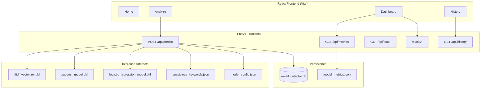

# JobGuard AI — Explainable Fake Job Posting Detection

JobGuard AI is a full-stack machine learning application that classifies job postings as legitimate or fraudulent. The system combines a React single-page application with a FastAPI backend, trained classifiers, and a local persistence layer so users can analyze postings, review model benchmarks, and audit past predictions.

The models are trained on the public [Fake Job Posting Prediction](https://www.kaggle.com/datasets/shivamb/real-or-fake-fake-jobposting-prediction) dataset (17,880 labeled records). The minority class (fraudulent postings) represents approximately 4.8% of the corpus, which informs the training strategy and evaluation metrics documented below.

---

## Table of Contents

1. [Overview](#overview)
2. [Key Features](#key-features)
3. [System Architecture](#system-architecture)
4. [Technology Stack](#technology-stack)
5. [Repository Structure](#repository-structure)
6. [Prerequisites](#prerequisites)
7. [Installation](#installation)
8. [Model Training](#model-training)
9. [Running the Application](#running-the-application)
10. [API Reference](#api-reference)
11. [Configuration](#configuration)
12. [Frontend Application](#frontend-application)
13. [Machine Learning Pipeline](#machine-learning-pipeline)
14. [Model Performance](#model-performance)
15. [Testing](#testing)
16. [Limitations and Responsible Use](#limitations-and-responsible-use)

---

## Overview

Job seekers and recruiters increasingly encounter fraudulent job advertisements designed to harvest personal data, solicit payments, or route victims into scam workflows. This project addresses that problem with an explainable classification pipeline:

- **Input:** Raw job posting text (title, description, requirements, or full combined copy).
- **Processing:** Text normalization, stopword removal, and TF-IDF vectorization using the same preprocessing logic at training and inference time.
- **Inference:** One of two classifiers (XGBoost or Logistic Regression) returns a label, confidence score, risk tier, matched suspicious keywords, and a human-readable explanation.
- **Persistence:** Each prediction is stored in a local SQLite database for history and aggregate statistics.

The default production-facing classifier is **XGBoost**, which achieves the highest precision and F1 score on the held-out test set. **Logistic Regression** remains available as a higher-recall alternative.

---

## Key Features


| Capability               | Description                                                                   |
| ------------------------ | ----------------------------------------------------------------------------- |
| Dual-model inference     | Switch between XGBoost and Logistic Regression at request time                |
| Explainable output       | Risk level, suspicious keyword hits, and narrative explanation per prediction |
| Class imbalance handling | SMOTE applied on the training split before model fitting                      |
| Model benchmarks         | Accuracy, precision, recall, F1, and confusion matrices exposed via REST      |
| Prediction history       | Last 100 scans retrieved from SQLite with timestamps and metadata             |
| Interactive dashboard    | Recharts visualizations and static evaluation assets served from the API      |
| OpenAPI documentation    | Auto-generated Swagger UI at `/docs` when the backend is running              |


---

## System Architecture




**Request lifecycle for classification**

1. The client sends `job_text` and optional `model_name` to `POST /api/predict`.
2. The backend cleans the text using the same rules as `backend/training/train_model.py`.
3. The persisted TF-IDF vectorizer transforms the cleaned string into a sparse feature vector.
4. The selected model predicts class `0` (Real) or `1` (Fake) and returns class probabilities.
5. The service derives risk level, matches global suspicious keywords, builds an explanation string, inserts a row into SQLite, and returns JSON to the client.

Models are loaded once at application startup (module import time in `predict.py`), not retrained per request.

---

## Technology Stack

### Backend


| Component     | Version / Library                                                                   |
| ------------- | ----------------------------------------------------------------------------------- |
| Runtime       | Python 3.10+ recommended                                                            |
| Web framework | FastAPI, Uvicorn                                                                    |
| ML            | scikit-learn, XGBoost, imbalanced-learn (SMOTE), NLTK, joblib, NumPy, pandas, SciPy |
| Persistence   | SQLite3 (stdlib)                                                                    |
| Validation    | Pydantic v2 (via FastAPI)                                                           |


### Frontend


| Component    | Version / Library |
| ------------ | ----------------- |
| UI framework | React 19          |
| Build tool   | Vite 8            |
| Routing      | React Router 7    |
| HTTP client  | Axios             |
| Charts       | Recharts          |
| Icons        | Lucide React      |


---

## Repository Structure

```
.
├── backend/
│   ├── app/
│   │   ├── main.py              # FastAPI entry point, CORS, static mount
│   │   ├── database.py          # SQLite schema and CRUD helpers
│   │   ├── schemas.py           # Pydantic request/response models
│   │   └── routes/
│   │       ├── predict.py       # POST /api/predict
│   │       └── metrics.py       # GET /api/metrics, /history, /stats
│   ├── models/                  # Trained .pkl files (generated; not always in VCS)
│   ├── static/
│   │   ├── model_metrics.json   # Evaluation metrics for dashboard
│   │   └── suspicious_keywords.json
│   ├── training/
│   │   ├── train_model.py       # End-to-end training script
│   │   ├── evaluate.py          # Confusion matrix and chart generation
│   │   └── data/
│   │       └── fake_job_postings.csv   # Kaggle dataset (user-provided)
│   ├── requirements.txt
│   └── test_api.py              # Manual integration smoke test
├── frontend/
│   ├── src/
│   │   ├── App.jsx              # Router and layout
│   │   ├── components/          # Navbar
│   │   ├── pages/               # Home, Analyze, Dashboard, History
│   │   └── services/api.js      # Axios client and API helpers
│   ├── package.json
│   └── vite.config.js
└── README.md
```

---

## Prerequisites

- **Python** 3.10 or newer with `pip` and virtual environment support
- **Node.js** 18 or newer with `npm`
- **Kaggle dataset:** Download `fake_job_postings.csv` and place it at `backend/training/data/fake_job_postings.csv` before training
- **Trained artefacts:** The API requires three pickle files under `backend/models/` unless you run the training script locally

---

## Installation

### 1. Clone the repository

```bash
git clone <repository-url>
cd "Fake Email Project"
```

### 2. Backend setup

```bash
cd backend
python -m venv venv

# Windows
.\venv\Scripts\activate

# macOS / Linux
source venv/bin/activate

pip install -r requirements.txt
```

On first run, NLTK stopwords are downloaded automatically by the training and prediction modules.

### 3. Frontend setup

```bash
cd frontend
npm install
```

---

## Model Training

Training is performed offline and is not triggered by the web server.

1. Obtain the dataset from Kaggle and save it as:
  ```
   backend/training/data/fake_job_postings.csv
  ```
2. Run the training script from the `backend` directory:
  ```bash
   cd backend
   python training/train_model.py
  ```
3. Optional: generate evaluation charts (confusion matrices, comparison plots):
  ```bash
   python training/evaluate.py
  ```

**Training script outputs**


| Output                    | Path                                           |
| ------------------------- | ---------------------------------------------- |
| XGBoost model             | `backend/models/xgboost_model.pkl`             |
| Logistic Regression model | `backend/models/logistic_regression_model.pkl` |
| TF-IDF vectorizer         | `backend/models/tfidf_vectorizer.pkl`          |
| Model config              | `backend/models/model_config.json`             |
| Metrics JSON              | `backend/static/model_metrics.json`            |
| Suspicious keywords       | `backend/static/suspicious_keywords.json`      |


If model files are missing, the API will fail at startup with an explicit error directing you to complete training or copy artefacts into `backend/models/`.

---

## Running the Application

Start the backend and frontend in separate terminals.

**Terminal 1 — API server**

```bash
cd backend
.\venv\Scripts\activate          # Windows
uvicorn app.main:app --reload    # by default it uses port 8000, you can change it using port flag
```

- API root: `http://localhost:8000`
- Interactive docs: `http://localhost:8000/docs`
- Health check: `http://localhost:8000/health`

**Terminal 2 — Frontend dev server**

```bash
cd frontend
npm run dev
```

- Application UI: `http://localhost:5173` (default Vite port)

Ensure `VITE_API_URL` is unset during local development so the frontend targets `http://localhost:8000` (see [Configuration](#configuration)).

---

## API Reference

All JSON API routes are prefixed with `/api`. Static assets are served at `/static/{filename}`.

### Health


| Method | Path      | Description                             |
| ------ | --------- | --------------------------------------- |
| `GET`  | `/`       | Service metadata and documentation link |
| `GET`  | `/health` | Liveness probe (`{"status": "ok"}`)     |


### Prediction

#### `POST /api/predict`

Classifies a job posting and persists the result.

**Request body**

```json
{
  "job_text": "Full text of the job posting to analyze...",
  "model_name": "xgboost"
}
```


| Field        | Type   | Required | Constraints                                             |
| ------------ | ------ | -------- | ------------------------------------------------------- |
| `job_text`   | string | Yes      | 20–10,000 characters                                    |
| `model_name` | string | No       | `xgboost` or `logistic_regression` (default: `xgboost`) |


**Response body**

```json
{
  "prediction": "Fake",
  "confidence": 0.94,
  "model_used": "logistic_regression",
  "risk_level": "High",
  "suspicious_keywords": ["home", "earn", "immediately"],
  "explanation": "The model is 94.0% confident this is a FAKE job posting ..."
}
```


| Field                 | Description                                                     |
| --------------------- | --------------------------------------------------------------- |
| `prediction`          | `"Real"` or `"Fake"`                                            |
| `confidence`          | Probability assigned to the predicted class (0.0–1.0)           |
| `risk_level`          | `High`, `Medium`, or `Low` (elevated only for Fake predictions) |
| `suspicious_keywords` | Subset of globally ranked keywords present in the cleaned text  |
| `explanation`         | Human-readable summary of the verdict                           |


**Risk level rules (Fake predictions only)**


| Confidence | Risk level |
| ---------- | ---------- |
| ≥ 0.80     | High       |
| ≥ 0.60     | Medium     |
| < 0.60     | Low        |


Real predictions always return `Low` risk.

**Error responses**


| Status | Condition                              |
| ------ | -------------------------------------- |
| `400`  | Invalid `model_name`                   |
| `422`  | Text too short or empty after cleaning |
| `500`  | Missing model artefacts at startup     |


### Metrics and history

#### `GET /api/metrics`

Returns held-out test metrics and dataset statistics from `backend/static/model_metrics.json`.

#### `GET /api/history`

Returns up to 100 most recent prediction records from SQLite, newest first.

#### `GET /api/stats`

Returns aggregate counts: total predictions, fake count, real count, and fake percentage across all stored scans.

---

## Configuration

### Backend CORS

Allowed origins are defined in `backend/app/main.py`:

- `http://localhost:5173` (Vite dev server)
- `http://localhost:3000` (fallback)

### Database location

SQLite database file: `backend/email_detector.db` (created automatically on first API startup). Database files are listed in `.gitignore` and are not committed to version control.

---

## Frontend Application


| Route        | Page      | Purpose                                                          |
| ------------ | --------- | ---------------------------------------------------------------- |
| `/`          | Home      | Product overview, pipeline description, and benchmark highlights |
| `/analyze`   | Analyze   | Submit job text, select model, view classification result        |
| `/dashboard` | Dashboard | Model metrics, dataset info, and evaluation visualizations       |
| `/history`   | History   | Browse prior predictions stored by the API                       |


The HTTP layer is centralized in `frontend/src/services/api.js`, which wraps Axios with a 15-second timeout and consistent `/api` prefix handling.

---

## Machine Learning Pipeline

### Data preparation

1. **Load** `fake_job_postings.csv` (17,880 rows).
2. **Combine** text fields: `title`, `company_profile`, `description`, `requirements`, `benefits`.
3. **Clean** text: lowercase, strip HTML, retain alphabetic tokens, remove English stopwords, drop tokens with length ≤ 2.
4. **Vectorize** with `TfidfVectorizer`:
  - `max_features=5000`
  - `ngram_range=(1, 2)`
  - `sublinear_tf=True`
  - `min_df=2`
5. **Split** 80/20 stratified train/test (`random_state=42`).
6. **Balance** training features with SMOTE (`random_state=42`) for Logistic Regression.
7. **Build** 9 structural features: `has_salary`, `has_logo`, `has_questions`, `telecommuting`, `title_len`, `desc_len`, `profile_len`, `short_desc`, `no_profile`.
8. **Combine** TF-IDF and structural features into a 5,009-dimensional sparse matrix.
9. **Train** XGBoost (`scale_pos_weight` for class imbalance, `n_estimators=300`, `max_depth=6`) and Logistic Regression (`max_iter=1000`, `C=1.0`, `solver=lbfgs`, SMOTE-balanced).
10. **Tune** classification thresholds via precision-recall curves for optimal F1.
11. **Evaluate** on the untouched test set; serialize models, config, metrics, and top discriminative keywords.

### Explainability

- **Suspicious keywords:** The fifty TF-IDF features with the largest Logistic Regression coefficients toward the Fake class are stored in `suspicious_keywords.json`. Structural feature signals are also extracted. At inference time, any keyword appearing in the cleaned posting is surfaced in the API response (up to five matches).
- **Narrative explanation:** A template string summarizes confidence, risk, and matched terms without exposing raw model coefficients to the client.

Inference preprocessing in `predict.py` must remain identical to `train_model.py`; any divergence will degrade accuracy.

---

## Model Performance

Metrics below are from the committed `model_metrics.json` (held-out 20% test split). Reported values may change if you retrain with a different random seed or dataset version.

### Dataset


| Metric              | Value  |
| ------------------- | ------ |
| Total records       | 17,880 |
| Legitimate postings | 17,014 |
| Fraudulent postings | 866    |
| Fraud rate          | 4.84%  |


### XGBoost (recommended default)


| Metric    | Value  |
| --------- | ------ |
| Accuracy  | 98.63% |
| Precision | 91.33% |
| Recall    | 79.19% |
| F1 score  | 84.83% |
| ROC-AUC   | 0.9874 |
| PR-AUC    | 0.9110 |


Highest precision model — when it says "Fake", it's almost always correct.

### Logistic Regression (higher recall alternative)


| Metric    | Value  |
| --------- | ------ |
| Accuracy  | 98.01% |
| Precision | 75.00% |
| Recall    | 88.44% |
| F1 score  | 81.17% |


Higher recall catches more fakes at the cost of more false positives. Trained with SMOTE on the same combined feature set.

For operational use cases where false positives carry a high cost (e.g., auto-rejecting legitimate employers), prefer XGBoost and treat outputs as advisory rather than authoritative.

---

## Visualizations

The training pipeline generates evaluation charts to help analyze model performance.

**Confusion Matrices (XGBoost vs Logistic Regression)**  
Confusion Matrices

**Model Metrics Comparison**  
Metrics Comparison

**Precision-Recall Curves**  
PR Curves

**Top Suspicious Keywords (TF-IDF)**  
Suspicious Keywords

**Structural Feature Signals**  
Structural Signals

**Dataset Distribution**  
Dataset Distribution

---

## Testing

### Manual API smoke test

With the backend running on port 8000:

```bash
cd backend
python test_api.py
```

This script exercises `/health`, `/api/metrics`, `/api/predict` (fake and real samples), `/api/stats`, and `/api/history`.

### Frontend lint

```bash
cd frontend
npm run lint
```

---

## Limitations and Responsible Use

This system is a **decision-support tool**, not a substitute for human judgment, background checks, or platform moderation policies.

- **Distribution shift:** Models reflect language patterns in the Kaggle corpus; novel scam formats may not be detected.
- **False positives and negatives:** Even at 98% accuracy, errors occur especially for ambiguous or unusually worded legitimate postings.
- **English-centric preprocessing:** Non-English postings may be poorly represented after cleaning.
- **Keyword explainability:** Surfaced terms indicate statistical association with the training label, not proven intent or illegality.
- **Privacy:** Submitted job text is stored locally (truncated to 2,000 characters per record). Do not submit personally identifiable information unless your deployment policy explicitly allows it.

Use predictions to prioritize review, not to make irreversible employment or legal decisions without additional verification.

---

## Acknowledgments

- Dataset: Shivam Bansal, *Real or Fake: Fake JobPosting Prediction* (Kaggle)
- Built with FastAPI, scikit-learn, XGBoost, React, and Vite

For questions, issues, or contributions, open an issue or pull request in the project repository.